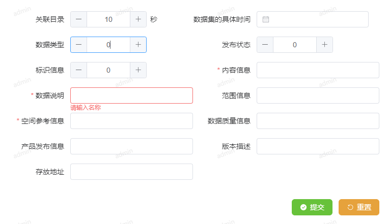

# form-create-helper

对[form-create](https://www.form-create.com/)进行二次封装, 增加易用性


# demo


```pug
// vue html部分, 这里使用pug语法来说明
FormCreateHelper(:form-binder="formBinder")
```


```typescript
// vue script部分, 使用typescript语法
import {
	FormCreateHelper,
	aFCMaker,
	useFormCreate,
	generateSelect,
} from "from-create-helper";

/**
 * 表单的项的定义
 */
const formRule = ref([

	/**
	 * hidden: 需要在数据中提现, 但是不在表单中出现
	 */
	aFCMaker.hidden("id"),

	/**
	 * 带单位的数字
	 */
	aFCMaker.number("categoryId", "关联目录", 10, {
		suffix: aFCMaker.getTextSuffix("秒"),
	}),

	/**
	 * 日期控件, 输出和输入为时间戳
	 */
	aFCMaker.date("dataDate", "数据集的具体时间",),
	
	aFCMaker.number("storageMethod", "数据类型",),
	aFCMaker.number("releaseType", "发布状态",),
	aFCMaker.number("identifierInfo", "标识信息",),

	/**
	 * 监听表单项的事件
	 */
	aFCMaker.input("contentInfo", "内容信息", {
		required,
		colSpan:12,
		on:{
			"update:modelValue"(val) {
				console.log(val, 'update:modelValue@contentInfo');
			}
		}
	}),

	/**
	 * 表单验证的demo和文档
	 * https://www.form-create.com/v3/guide/other/validation-rules
	 */
	aFCMaker.input("dataDescription", "数据说明",
		{
			validate: [
				{
					type: 'string', required: true, message:'请输入名称'
				},
				{
					validator(rule, value, callback) {
						if ((value+"").length<5) {
							callback("内容过于短,请输入至少5个字符");
						} else {
							callback()
						}
					}
				}
			],
		}
	),

	/**
	 * 下拉框类型, 可以从接口获取候选项
	 */
	aFCMaker.component(generateSelect(()=>[["1", "专家"], ["52", "教授"]]), "scopeInfo", "范围信息"),

	aFCMaker.input("scopeInfo", "范围信息",),

	/**
	 * 必填项的简写
	 */
	aFCMaker.input("spatialReferenceInfo", "空间参考信息", {required, placeholder: '必填项'}),

	aFCMaker.input("dataQualityInfo", "数据质量信息",),
	aFCMaker.input("releaseInfo", "产品发布信息",),
	aFCMaker.input("versionDesc", "版本描述",),
	aFCMaker.input("storageLocation", "存放地址",),
]);


/**
 * 表单的配置
 */
const {formCreateAllBind, setFormData, fullReset} = useFormCreate({
	rule: formRule,
	async onSubmit(formData, api, ...rest) {
		const data = {...formData}
		const url = isCreate.value ? "trgis-data/data/meta/add" : "trgis-data/data/meta/update";
		const [err, resp] = await tryToRequest({url, data, method: "post"});
		if (err) {
			ElMessage.error(err.message);
		}else{
			ElMessage.success("操作成功");
			formVisible.value = false;
			updateParams()
		}
	},
	global: {
		"*": {
			col: {
				span: 12
			}
		}
	}
});

```
